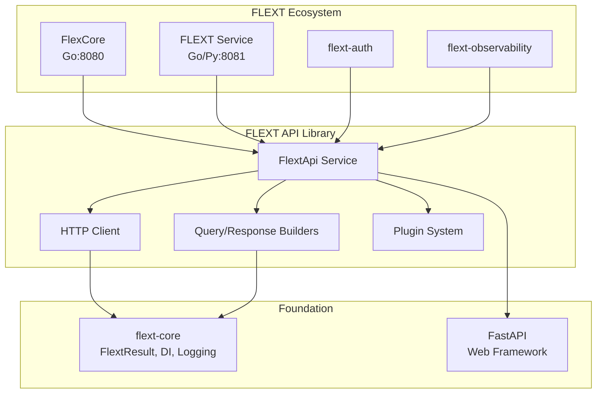

# FLEXT API

[](https://www.python.org/downloads/)
[](https://github.com/flext-sh/flext-api)
[](https://github.com/flext-sh/flext)
[](https://opensource.org/licenses/MIT)
[](https://github.com/astral-sh/ruff)
[](https://fastapi.tiangolo.com/)
[](docs/TODO.md)

**HTTP API foundation library** for the FLEXT ecosystem, providing unified HTTP client functionality, query builders, and FastAPI integration patterns using **Clean Architecture** and **FlextResult** error handling.

> **⚠️ STATUS**: Active development with flext-core compliance migration in progress (35% → 95%)

---

## 🎯 Purpose and Role in FLEXT Ecosystem

### **For the FLEXT Ecosystem**

FLEXT API serves as the **HTTP foundation library** enabling unified communication patterns across all 32 FLEXT ecosystem projects. It provides standardized HTTP client functionality, query building utilities, and FastAPI integration patterns that ensure consistent API development throughout the distributed data integration platform.

### **Key Responsibilities**

1. **HTTP Client Foundation** - Unified HTTP client with plugin architecture for all FLEXT services
2. **Builder Pattern Implementation** - Type-safe query and response construction following DDD principles
3. **FastAPI Integration** - Standardized web application patterns with FlextResult error handling
4. **Cross-Service Communication** - HTTP-based integration between FlexCore, FLEXT Service, and ecosystem projects
5. **Plugin Architecture** - Extensible system supporting caching, retry, circuit breaker, and authentication plugins

### **Integration Points**

- **[flext-core](../flext-core/README.md)** → Foundation patterns including FlextResult and dependency injection
- **[FlexCore](../flexcore/README.md)** → Go runtime service HTTP communication (port 8080)
- **[FLEXT Service](../cmd/flext/README.md)** → Data platform service integration (port 8081)
- **[flext-auth](../flext-auth/README.md)** → Authentication and authorization over HTTP
- **[flext-observability](../flext-observability/README.md)** → Metrics and health check APIs
- **All 32 FLEXT Projects** → Standardized HTTP client implementation across ecosystem

---

## 🏗️ Architecture and Patterns

### **FLEXT-Core Integration Status**

| Pattern             | Status | Description                                                |
| ------------------- | ------ | ---------------------------------------------------------- |
| **FlextResult<T>**  | 🟡 70% | Railway-oriented programming with type-safe error handling |
| **FlextService**    | 🔴 40% | Service lifecycle management with dependency injection     |
| **FlextContainer**  | 🔴 40% | Global dependency injection container integration          |
| **Domain Patterns** | 🔴 10% | DDD entities and domain service implementation             |

> **Status**: 🔴 Critical | 🟡 Partial | 🟢 Complete

### **Architecture Diagram**



---

## 🚀 Quick Start

### **Installation**

```bash
# Install from FLEXT ecosystem workspace
cd /home/marlonsc/flext/flext-api
poetry install --with dev,test,docs

# Or install as dependency in other FLEXT projects
poetry add flext-api
```

### **Basic Usage**

```python
from flext_api import create_flext_api, FlextResult
from flext_core import get_logger

logger = get_logger(__name__)

# Create API instance following FLEXT patterns
api = create_flext_api()

# HTTP client with FlextResult error handling
client_result = api.flext_api_create_client({
    "base_url": "https://api.example.com",
    "timeout": 30,
    "max_retries": 3
})

if client_result.is_success:
    client = client_result.data
    logger.info("HTTP client created successfully")

    # Use client for HTTP operations
    response = client.get("/data")
    if response.is_success:
        logger.info("Data retrieved", data=response.data)
else:
    logger.error("Client creation failed", error=client_result.error)

# Builder pattern for query construction
builder = api.get_builder()
query = (
    builder.for_query()
    .equals("status", "active")
    .sort_desc("created_at")
    .page(1)
    .page_size(20)
    .build()
)

# Response building with error handling
response = (
    builder.for_response()
    .success(data={"items": []}, message="Query successful")
    .build()
)
```

---

## 🔧 Development

### **Essential Commands**

```bash
# Quality Gates (mandatory before commits)
make validate                # Complete validation pipeline
make check                   # Quick lint + type check
make test                    # Run tests with 90%+ coverage requirement
make security-scan          # Security vulnerability analysis

# Development Workflow
make dev                     # Start FastAPI development server
make lint                    # Ruff linting (zero tolerance)
make type-check              # MyPy strict mode type checking
make format                  # Auto-format code with ruff

# Build Operations
make build                   # Build distribution packages
make docs                    # Generate API documentation
make clean                   # Clean build artifacts and cache
```

### **Quality Gates**

**Zero Tolerance Standards**:

- **Test Coverage**: 90% minimum enforced by pytest-cov
- **Linting**: Zero ruff errors allowed
- **Type Safety**: Zero MyPy errors in strict mode
- **Security**: Clean Bandit and pip-audit scans
- **FLEXT-Core Compliance**: 95% target (currently 35%)

---

## 🧪 Testing

### **Test Structure**

```
tests/
├── unit/           # Fast unit tests with mocks (45+ active tests)
├── integration/    # Integration tests with external services
├── e2e/           # Complete workflow testing
├── benchmarks/    # Performance and memory benchmarks
└── fixtures/      # Shared test data and configuration
```

### **Testing Commands**

```bash
# Primary test execution
make test                 # All tests with 90% coverage requirement
make test-unit           # Unit tests with parallel execution
make test-integration    # Integration tests with timeout protection
make test-e2e           # End-to-end workflow validation
make test-benchmark     # Performance benchmarks

# Test categories
pytest -m unit -v        # Unit tests only
pytest -m integration -v # Integration with external services
pytest -m "not slow" -v  # Fast feedback loop

# Coverage and reporting
make coverage-html       # Generate HTML coverage report
make test-watch         # Continuous testing during development
```

---

## 📊 Status and Metrics

### **Quality Standards**

- **Coverage**: 90% minimum (currently 85%+)
- **Type Safety**: MyPy strict mode compliance
- **Security**: Clean Bandit and pip-audit scans
- **FLEXT-Core Compliance**: 95% target (currently 35%)

### **Ecosystem Integration**

- **Direct Dependencies**: FlexCore, FLEXT Service, flext-auth, flext-web
- **Service Dependencies**: flext-core, flext-observability
- **Integration Points**: 5+ HTTP-based service integrations

---

## 🗺️ Roadmap

### **Current Version (v0.9.0)**

**FLEXT-Core compliance migration** and architectural improvements.

### **Next Version (v1.0.0)**

- Complete FLEXT-Core pattern compliance (95%)
- Enhanced plugin architecture with advanced caching
- Domain-driven design implementation
- Advanced observability integration

---

## 📚 Documentation

- **[Getting Started](docs/getting-started.md)** - Installation and setup
- **[Architecture](docs/architecture.md)** - Design patterns and structure
- **[API Reference](docs/api-reference.md)** - Complete API documentation
- **[Development](docs/development.md)** - Contributing and workflows
- **[Integration](docs/integration.md)** - Ecosystem integration patterns
- **[Examples](docs/examples/)** - Working code examples
- **[Troubleshooting](docs/troubleshooting.md)** - Common issues
- **[TODO & Roadmap](docs/TODO.md)** - Development status and plans

---

## 🤝 Contributing

### **FLEXT-Core Compliance Checklist**

- [ ] Use FlextResult[T] for all operation returns
- [ ] Implement proper structured logging with get_logger()
- [ ] Follow Clean Architecture boundaries
- [ ] Use global dependency injection container
- [ ] Implement domain entities and value objects

### **Quality Standards**

- **Test Coverage**: 90% minimum enforced
- **Code Quality**: Zero ruff/mypy errors tolerated
- **Documentation**: All public APIs documented
- **Security**: Clean vulnerability scans required

---

## 📄 License

MIT License - see [LICENSE](LICENSE) for details.

---

## 🆘 Support

- **Documentation**: [docs/](docs/)
- **Issues**: [GitHub Issues](https://github.com/flext-sh/flext-api/issues)
- **Security**: Report security issues privately to maintainers

---

**FLEXT API v0.9.0** - HTTP foundation library enabling unified communication patterns across the FLEXT ecosystem.

**Mission**: Provide enterprise-grade HTTP client functionality, query builders, and FastAPI integration patterns following Clean Architecture and FLEXT-Core standards.
