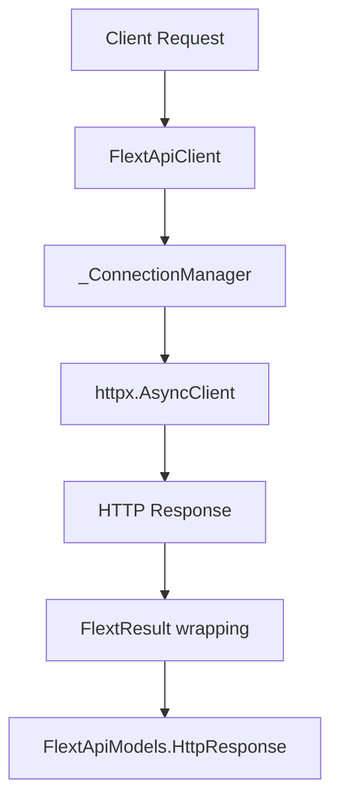
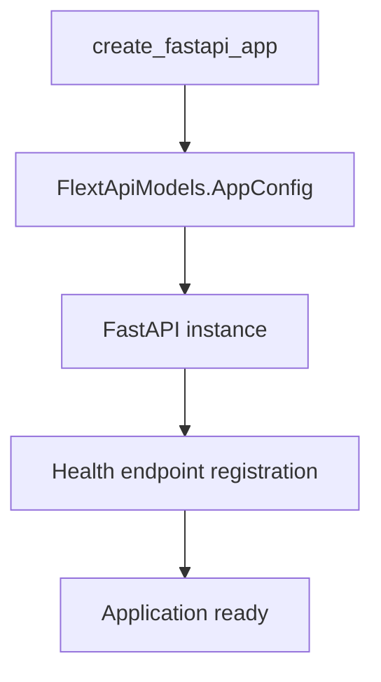

# Architecture - flext-api

**Basic HTTP client and FastAPI integration architecture** using flext-core patterns.

> **Updated**: September 17, 2025 | **Version**: 0.9.0 | **Based on actual src/ analysis**

---

## 🎯 Purpose

flext-api provides basic HTTP client functionality and FastAPI application creation for the FLEXT ecosystem using httpx and modern async patterns.

### Current Scope

- HTTP client wrapper around httpx.AsyncClient
- FastAPI application factory with health endpoints
- Pydantic v2 domain models for requests/responses
- FlextResult patterns for error handling

---

## 📁 Module Structure

### Source Organization (Actual)

```
src/flext_api/
├── __init__.py           # Public API exports (57 lines)
├── api.py               # FlextApi facade (135 lines)
├── app.py               # FastAPI factory (41 lines)
├── client.py            # FlextApiClient core (593 lines)
├── config.py            # Configuration (187 lines)
├── constants.py         # Constants and enums (349 lines)
├── enums.py             # StorageBackend enum (25 lines)
├── exceptions.py        # Exception hierarchy (184 lines)
├── factory.py           # Client factory (62 lines)
├── models.py            # Domain models (400 lines)
├── plugins/__init__.py  # Empty plugin system (10 lines)
├── protocols.py         # Interface definitions (107 lines)
├── storage.py           # Storage abstraction (236 lines)
├── typings.py           # Type definitions (65 lines)
└── utilities.py         # Helper functions (390 lines)
```

**Total**: 2,841 lines of code across 15 modules

---

## 🧱 Core Components

### 1. HTTP Client Implementation

**FlextApiClient** (`client.py` - 593 lines)

Current capabilities:
- httpx.AsyncClient wrapper with basic configuration
- Timeout support (configurable, default 30s)
- FlextResult error handling patterns
- Basic async HTTP methods (GET, POST, PUT, DELETE)

Current limitations:
- No retry logic or exponential backoff
- No connection pooling optimization
- No HTTP/2 configuration
- No streaming response support

```python
# Current implementation
class FlextApiClient(FlextDomainService[object]):
    def __init__(self, config=None, **kwargs):
        # Creates basic httpx.AsyncClient(base_url, timeout)
        self._connection_manager = self._ConnectionManager(base_url, timeout)

    async def request(self, method, url, **kwargs):
        # Basic request with timeout, returns FlextResult
```

### 2. FastAPI Integration

**create_fastapi_app** (`app.py` - 41 lines)

Current capabilities:
- Basic FastAPI app creation with configuration
- Built-in /health endpoint
- Application metadata (title, version, description)

Current limitations:
- No middleware integration
- No CORS configuration
- No authentication patterns
- No request/response logging

```python
# Current implementation
def create_fastapi_app(config: FlextApiModels.AppConfig) -> object:
    app = FastAPI(title=config.title, version=config.app_version, ...)

    @app.get("/health")
    async def health_check() -> dict[str, str]:
        return {"status": "healthy", "service": "flext-api"}

    return app
```

### 3. Domain Models

**FlextApiModels** (`models.py` - 400 lines)

Implemented models:
- HttpRequest: method, url, headers, body, timeout
- HttpResponse: status_code, body, headers, url, method
- ClientConfig: base_url, timeout, max_retries, headers
- AppConfig: title, app_version, description, docs_url

Test alignment issues:
- PaginationConfig: tests expect `.page` but model has `current_page` with alias
- Some validation stricter than expected by existing tests

---

## 🔄 Data Flow

### HTTP Request Flow



### FastAPI Application Flow



---

## 📊 Current Status vs Modern Standards

### HTTP Client Patterns (2025 Standards)

| Feature | Current Status | Modern Standard | Priority |
|---------|---------------|-----------------|----------|
| Async Support | ✅ httpx.AsyncClient | ✅ Required | Complete |
| Timeout | ✅ Basic timeout | ✅ Required | Complete |
| Retry Logic | ❌ Missing | ✅ Exponential backoff | High |
| Connection Pooling | ❌ Basic client | ✅ Optimized pools | High |
| HTTP/2 | ❌ Not configured | ✅ Available via httpx | Medium |
| Streaming | ❌ Missing | ✅ Large response support | Medium |
| Authentication | 🟡 Basic token support | ✅ Bearer/OAuth/API Key | Medium |

### Architecture Quality

- **Separation of Concerns**: Good (client, models, config separate)
- **Error Handling**: Good (FlextResult patterns implemented)
- **Type Safety**: Good (Pydantic v2, type hints)
- **Testing**: Needs improvement (73% coverage, 59 failing tests)
- **Documentation**: Needs alignment with reality

---

## 🎯 Architecture Improvements Needed

### 1. HTTP Client Enhancement

Based on 2025 best practices research:

```python
# Target implementation for v1.0.0
class FlextApiClient:
    def __init__(self, config):
        # Connection pooling with limits
        limits = httpx.Limits(max_keepalive=20, max_connections=100)

        # HTTP/2 support
        self._client = httpx.AsyncClient(
            base_url=config.base_url,
            timeout=config.timeout,
            limits=limits,
            http2=config.enable_http2,
        )

        # Retry configuration
        self._retry_config = RetryConfig(
            max_retries=config.max_retries,
            backoff_factor=1.5,
            status_codes=[429, 500, 502, 503, 504]
        )
```

### 2. Middleware Plugin System

```python
# Target plugin architecture
class FlextApiPlugins:
    class RetryPlugin:
        async def process_request(self, request):
            # Implement exponential backoff retry logic

    class LoggingPlugin:
        async def process_request(self, request):
            # Structured logging with correlation IDs

    class AuthPlugin:
        async def process_request(self, request):
            # Bearer token, API key, OAuth support
```

### 3. Streaming Support

```python
# Target streaming implementation
async def stream_request(self, method, url, **kwargs):
    async with self._client.stream(method, url, **kwargs) as response:
        async for chunk in response.aiter_bytes():
            yield chunk
```

---

## 🔗 Integration with FLEXT Core

### Current Integration

- ✅ FlextResult patterns for error handling
- ✅ FlextDomainService base class usage
- ✅ FlextModels.Entity/Value inheritance
- ✅ FlextLogger integration (FlextLogger(__name__))

### Integration Quality

Based on actual testing:
- Error handling works well with FlextResult
- Domain models properly use flext-core patterns
- Configuration follows FLEXT ecosystem standards
- Type safety maintained across integration points

---

**Last Updated**: September 17, 2025 | **Reality-Based Documentation**

> This architecture document reflects the actual current implementation in src/, not aspirational features. All claims verified through code analysis.