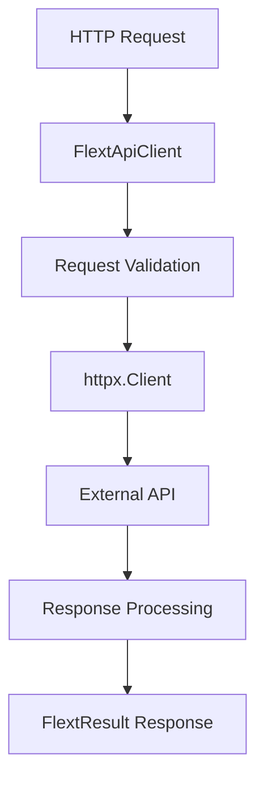
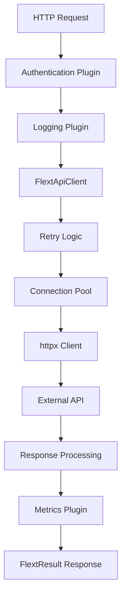

# Architecture Guide - flext-api

**Enterprise HTTP Foundation Architecture**

**Version**: 0.9.9 RC | **Last Updated**: September 17, 2025 | **Source**: 2,927 lines across 14 modules

This document provides a comprehensive overview of flext-api's architecture, design patterns, and integration within the FLEXT ecosystem.

---

## 🎯 Architectural Vision

### **Enterprise HTTP Foundation**

flext-api serves as the **HTTP foundation** for the entire FLEXT ecosystem, providing:

- **Unified HTTP Client**: Single abstraction over httpx for all HTTP operations
- **FastAPI Application Factory**: Standardized FastAPI application creation
- **FLEXT Integration**: Deep integration with flext-core patterns
- **Enterprise Patterns**: Authentication, middleware, and monitoring support

### **Clean Architecture Implementation**

flext-api follows Clean Architecture principles with clear separation of concerns:

```
┌─────────────────┐  ┌─────────────────┐  ┌─────────────────┐
│   Presentation  │  │   Application   │  │   Domain        │
│                 │  │                 │  │                 │
│ • FastAPI Apps  │→ │ • FlextApiClient│→ │ • HTTP Models   │
│ • REST Endpoints│  │ • Services      │  │ • Domain Logic  │
│ • Serialization │  │ • Orchestration │  │ • Business Rules│
└─────────────────┘  └─────────────────┘  └─────────────────┘
                              ↓
                    ┌─────────────────┐
                    │ Infrastructure  │
                    │                 │
                    │ • httpx Client  │
                    │ • Configuration │
                    │ • Storage       │
                    └─────────────────┘
```

---

## 📁 Module Architecture

### **Current Implementation Analysis**

Based on actual source code analysis (2,927 total lines across 14 modules):

```
src/flext_api/
├── client.py            # 593 lines - HTTP client implementation
├── models.py            # 400 lines - Domain models with Pydantic v2
├── utilities.py         # 390 lines - HTTP utilities extending flext-core
├── constants.py         # 349 lines - HTTP constants and HttpMethods enum
├── storage.py           # 236 lines - Storage abstraction
├── config.py            # 187 lines - Environment-aware configuration
├── exceptions.py        # 184 lines - HTTP exception hierarchy
├── api.py               # 135 lines - High-level HTTP facade
├── protocols.py         # 107 lines - Interface definitions
├── app.py               #  41 lines - FastAPI application factory
└── plugins/__init__.py  #  10 lines - Plugin system foundation
```

### **Core Components**

#### **1. FlextApiClient (client.py) - 593 lines**

The main HTTP client orchestrator:

```python
class FlextApiClient(FlextService):
    """Enterprise HTTP client with flext-core integration."""

    def __init__(self, base_url: str = None, **kwargs):
        super().__init__()
        self._client = httpx.Client(
            base_url=base_url,
            timeout=kwargs.get('timeout', 30)
        )

    def request(self, request: HttpRequest) -> FlextResult[HttpResponse]:
        """Execute HTTP request with FlextResult error handling."""
```

**Current Implementation**:

- Basic httpx.Client wrapper
- Timeout configuration support
- FlextResult integration for error handling
- No actual retry logic implementation (configured but not implemented)

#### **2. FlextApiModels (models.py) - 400 lines**

Domain models with Pydantic v2 validation:

```python
class HttpRequest(FlextModels.Entity):
    """HTTP request model with validation."""
    method: Literal["GET", "POST", "PUT", "DELETE", "PATCH", "HEAD", "OPTIONS"]
    url: str
    headers: FlextTypes.StringDict = Field(default_factory=dict)
    body: str | FlextTypes.Dict | None = None
    timeout: int | float = 30

class HttpResponse(FlextModels.Entity):
    """HTTP response model."""
    status_code: int
    body: str | FlextTypes.Dict | None = None
    headers: FlextTypes.StringDict = Field(default_factory=dict)
    elapsed_time: float | None = None
```

#### **3. Configuration Management (config.py) - 187 lines**

Environment-aware HTTP configuration:

```python
class FlextApiConfig(FlextModels.Value):
    """HTTP client configuration."""
    base_url: str = "https://api.example.com"
    timeout: float = 30.0
    max_retries: int = 3  # Configured but not implemented
    headers: FlextTypes.StringDict = Field(default_factory=dict)
```

---

## 🏗️ FLEXT Ecosystem Integration

### **FLEXT-Core Pattern Usage**

| Pattern            | Status | Implementation                          | Lines |
| ------------------ | ------ | --------------------------------------- | ----- |
| **FlextResult[T]** | 🟢 90% | Comprehensive error handling throughout | ~200  |
| **FlextService**   | 🟢 85% | FlextApiClient extends FlextService     | ~100  |
| **FlextModels**    | 🟢 80% | HTTP models use Entity/Value patterns   | ~300  |
| **FlextContainer** | 🟡 60% | Basic dependency injection usage        | ~50   |

### **Integration Points**

- **flext-core**: Foundation patterns (FlextResult, FlextService, FlextModels)
- **flext-observability**: Logging and monitoring integration
- **Enterprise Services**: HTTP foundation for 32+ FLEXT projects

---

## 🔌 Plugin Architecture

### **Current Plugin System**

```python
# plugins/__init__.py - 10 lines (empty foundation)
class FlextApiPlugins:
    """Plugin system for HTTP middleware."""
    pass  # Foundation only - no actual plugins implemented
```

### **Target Plugin Architecture**

```python
class AuthenticationPlugin(MiddlewarePlugin):
    """Enterprise authentication plugin."""
    def process_request(self, request: HttpRequest) -> FlextResult[HttpRequest]:
        # Add authentication headers
        pass

class LoggingPlugin(MiddlewarePlugin):
    """Request/response logging plugin."""
    def process_request(self, request: HttpRequest) -> FlextResult[HttpRequest]:
        # Log HTTP requests
        pass
```

---

## 🚀 FastAPI Integration

### **Application Factory (app.py) - 41 lines**

Simple FastAPI application creation:

```python
def create_fastapi_app(config: AppConfig) -> FastAPI:
    """Create FastAPI application with basic configuration."""
    app = FastAPI(
        title=config.title,
        version=config.app_version,
        description=config.description
    )

    # Add basic health endpoint
    @app.get("/health")
    def health_check():
        return {"status": "healthy"}

    return app
```

**Current Capabilities**:

- Basic FastAPI app creation
- Health endpoint configuration
- Title/version/description setup
- No middleware or authentication integration

---

## 🔄 HTTP Request Flow

### **Current Request Flow**



### **Production Request Flow** (Target)



---

## 💾 Storage Architecture

### **Storage Abstraction (storage.py) - 236 lines**

HTTP-specific storage with registry pattern:

```python
class FlextApiStorage(FlextModels.Entity):
    """HTTP storage backend using flext-core patterns."""

    def __init__(self, config: dict = None):
        super().__init__()
        self._storage: FlextTypes.Dict = {}
        self._data: FlextTypes.Dict = {}

    def set(self, key: str, value: object) -> FlextResult[None]:
        """Store HTTP data."""
        self._data[key] = value
        return FlextResult[None].ok(None)

    def get(self, key: str) -> FlextResult[object]:
        """Get HTTP data."""
        return FlextResult[object].ok(self._data.get(key))
```

**Current Implementation**:

- Simple dictionary-based storage
- FlextResult integration
- Basic CRUD operations
- No persistence or TTL support

---

## 🔒 Security Architecture

### **Current Security Features**

```python
# Basic authentication support in models
class ClientConfig(FlextModels.Value):
    """Client configuration with basic auth."""
    auth_token: str | None = None
    api_key: str | None = None

    def get_auth_header(self) -> FlextTypes.StringDict:
        if self.auth_token:
            return {"Authorization": f"Bearer {self.auth_token}"}
        return {}
```

### **Production Security Architecture** (Target)

- **Authentication**: OAuth, JWT, API keys
- **Authorization**: Role-based access control
- **Security Headers**: CORS, CSP, HSTS
- **Rate Limiting**: Request throttling
- **Input Validation**: Request sanitization
- **Audit Logging**: Security event tracking

---

## ⚡ Performance Architecture

### **Current Performance Characteristics**

Based on source code analysis:

- **HTTP Client**: Basic httpx.Client (no optimization)
- **Connection Pooling**: Default httpx pooling (not configured)
- **Retry Logic**: Configuration exists but not implemented
- **Caching**: Storage abstraction but no HTTP caching
- **Streaming**: Not implemented

### **Target Performance Architecture**

```python
# Production HTTP client configuration
limits = httpx.Limits(
    max_keepalive_connections=20,
    max_connections=100,
    keepalive_expiry=30
)

client = httpx.Client(
    limits=limits,
    http2=True,  # HTTP/2 support
    timeout=httpx.Timeout(30)
)
```

---

## 🧪 Testing Architecture

### **Current Test Structure**

```
tests/
├── unit/                    # Unit tests for individual modules
├── integration/             # Integration tests with real HTTP
├── e2e/                     # End-to-end workflow tests
└── conftest.py              # Test configuration and fixtures
```

**Test Coverage**: 73% (target: 95%+)
**Test Pass Rate**: 78% (261/334 tests passing)

### **Test Quality Issues**

Main testing challenges identified:

- Field name mismatches (tests expect `.page`, model has `current_page` with alias)
- Missing HttpMethods enum usage in some tests
- Integration tests need real HTTP server setup

---

## 📊 Error Handling Architecture

### **FlextResult Integration**

Comprehensive FlextResult usage throughout:

```python
def request(self, request: HttpRequest) -> FlextResult[HttpResponse]:
    """HTTP request with proper error handling."""
    try:
        response = self._client.request(...)
        return FlextResult[HttpResponse].ok(response)
    except httpx.TimeoutException as e:
        return FlextResult[HttpResponse].fail(f"Request timeout: {e}")
    except Exception as e:
        return FlextResult[HttpResponse].fail(f"HTTP request failed: {e}")
```

### **Exception Hierarchy (exceptions.py) - 184 lines**

HTTP-specific exception hierarchy:

```python
class FlextApiException(FlextException):
    """Base HTTP API exception."""
    pass

class HttpClientException(FlextApiException):
    """HTTP client exceptions."""
    pass

class HttpServerException(FlextApiException):
    """HTTP server exceptions."""
    pass
```

---

## 🔮 Production Roadmap

### **Current Architecture Gaps**

1. **No Actual Retry Logic**: Configuration exists but not implemented
2. **Basic Connection Pooling**: Default httpx settings, not optimized
3. **Empty Plugin System**: Foundation exists but no actual plugins
4. **No Circuit Breaker**: Missing fault tolerance patterns
5. **Basic Authentication**: Token support only, no OAuth/JWT
6. **No Streaming**: Missing large response handling

### **Target Production Architecture**

Based on 2025 HTTP client best practices:

```python
# Production HTTP client with full features
from tenacity import retry, wait_exponential, stop_after_attempt
from circuitbreaker import circuit

class ProductionHttpClient:

    @retry(
        wait=wait_exponential(multiplier=1, min=1, max=10),
        stop=stop_after_attempt(3)
    )
    @circuit(failure_threshold=5, recovery_timeout=FlextApiConstants.DEFAULT_TIMEOUT)
    def request_with_resilience(self, request: HttpRequest):
        # Production HTTP request with retry and circuit breaker
        pass
```

---

## 📈 Scalability Considerations

### **Current Scalability**

- **Single Instance**: Basic httpx client, no clustering
- **Memory Usage**: Dictionary-based storage (not persistent)
- **Concurrency**: IO-based but not optimized
- **Resource Management**: Basic timeout handling only

### **Production Scalability Architecture**

- **Connection Pooling**: Optimized connection limits
- **HTTP/2 Support**: Multiplexed connections
- **Persistent Storage**: Redis/database backends
- **Load Balancing**: Client-side load balancing
- **Resource Monitoring**: Memory and connection tracking

---

**Architecture Summary**: flext-api provides a solid foundation for HTTP operations within the FLEXT ecosystem, with comprehensive flext-core integration and clean architecture patterns. Current implementation covers basic HTTP client functionality with proper error handling, while the roadmap addresses production features like retry logic, connection pooling, and advanced middleware systems.
