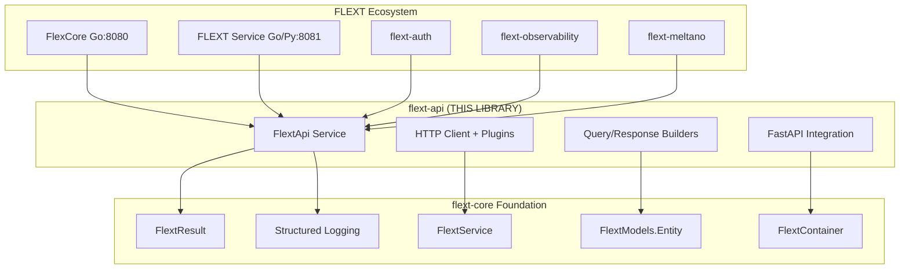

# Architecture Guide - FLEXT API

**Complete architectural documentation** to understand flext-core patterns and FLEXT API library structure.

> **📊 Compliance Status**: 35% → 95% (Target) | See [TODO.md](TODO.md) for detailed gaps

---

## 🏗️ Architectural Overview

### **Position in FLEXT Ecosystem**

**flext-api** acts as the **HTTP foundation library** for the entire FLEXT ecosystem, implementing consistent architectural patterns across 33 interconnected projects.



---

## 🎯 Architectural Principles

### **1. Clean Architecture**

Rigorous Clean Architecture implementation with clear separation of responsibilities:

```
src/flext_api/
├── domain/              # Domain Layer - Business Rules
│   ├── entities.py      # Rich domain entities
│   └── value_objects.py # Immutable value objects
├── application/         # Application Layer - Use Cases
├── infrastructure/      # Infrastructure Layer - External concerns
│   └── config.py        # Configuration management
├── api.py              # Interface Adapters - Main API
├── client.py           # Interface Adapters - HTTP Client
├── builder.py          # Interface Adapters - Builders
└── main.py             # Frameworks & Drivers - FastAPI
```

**Dependency Flow**:

- Infrastructure → Application → Domain
- Interface Adapters → Application
- Frameworks → Interface Adapters

### **2. Domain-Driven Design (DDD)**

Rich domain modeling with entities that encapsulate business logic:

```python
from flext_core import FlextModels.Entity, FlextResult

class ApiRequest(FlextModels.Entity):
    """Rich domain entity for HTTP requests."""

    method: str
    url: str
    headers: dict[str, str]
    payload: dict[str, object] | None = None
    timeout: float = 30.0
    retry_count: int = 0
    max_retries: int = 3

    def validate_domain_rules(self) -> FlextResult[None]:
        """Business rules validation."""
        if not self.url.startswith(('http://', 'https://')):
            return FlextResult[None].fail(
                error="Invalid URL protocol",
                error_code="INVALID_URL_PROTOCOL"
            )

        if self.timeout <= 0:
            return FlextResult[None].fail(
                error="Timeout must be positive",
                error_code="INVALID_TIMEOUT"
            )

        return FlextResult[None].ok(None)

    def increment_retry(self) -> FlextResult[Self]:
        """Domain logic for retry handling."""
        if self.retry_count >= self.max_retries:
            return FlextResult[None].fail(
                error="Maximum retries exceeded",
                error_code="MAX_RETRIES_EXCEEDED"
            )

        return self.copy_with(retry_count=self.retry_count + 1)

    def is_retryable(self) -> bool:
        """Business logic to determine if retryable."""
        return self.retry_count < self.max_retries
```

### **3. Railway-Oriented Programming**

Consistent use of **FlextResult[T]** pattern for error handling without exceptions:

```python
from flext_core import FlextResult

def monadic_pipeline(data: dict) -> FlextResult[ProcessedData]:
    """Monadic pipeline with functional composition."""
    return (
        validate_input(data)
        .flat_map(lambda valid: transform_data(valid))
        .flat_map(lambda transformed: enrich_data(transformed))
        .map(lambda enriched: ProcessedData.from_dict(enriched))
    )

# Usage in services
def service_operation(request: dict) -> FlextResult[dict]:
    pipeline_result = monadic_pipeline(request)

    if pipeline_result.is_failure:
        logger.error("Pipeline failed", error=pipeline_result.error)
        return pipeline_result

    processed_data = pipeline_result.data
    return FlextResult[None].ok({"processed": processed_data.to_dict()})
```

---

## 🔧 Core Components

### **1. FlextApi Service**

**Location**: `src/flext_api/api.py`  
**Responsibility**: Facade pattern for all library functionality

#### **Current Status vs. Target**

| Aspect          | Current                         | FLEXT-Core Target               |
| --------------- | ------------------------------- | ------------------------------- |
| **Inheritance** | 🔴 Doesn't inherit FlextService | ✅ class FlextApi(FlextService) |
| **Lifecycle**   | 🟡 async start/stop             | ✅ sync start/stop/health_check |
| **Logging**     | 🔴 direct structlog             | ✅ FlextLogger(**name**)         |
| **Container**   | 🔴 Manual DI                    | ✅ FlextContainer.get_global()        |

#### **Target Implementation**

```python
from flext_core import FlextService, FlextResult, FlextLogger, get_flext_container

class FlextApi(FlextService):
    """✅ Service compliant with flext-core patterns."""

    def __init__(self) -> None:
        self.logger = FlextLogger(__name__)
        self.container = FlextContainer.get_global()
        self._builder: FlextApiBuilder | None = None
        self._client: FlextApiClient | None = None

    def start(self) -> FlextResult[None]:
        """✅ Sync start method following FlextService contract."""
        try:
            # Initialize components
            self._builder = self.container.get_typed("api_builder", FlextApiBuilder)
            self.logger.info("FlextApi service started")
            return FlextResult[None].ok(None)
        except Exception as e:
            self.logger.exception("Service start failed")
            return FlextResult[None].fail(
                error=f"Service startup failed: {e}",
                error_code="SERVICE_START_FAILED"
            )

    def stop(self) -> FlextResult[None]:
        """✅ Sync stop method following FlextService contract."""
        try:
            if self._client:
                # Cleanup client resources
                pass
            self.logger.info("FlextApi service stopped")
            return FlextResult[None].ok(None)
        except Exception as e:
            return FlextResult[None].fail(
                error=f"Service shutdown failed: {e}",
                error_code="SERVICE_STOP_FAILED"
            )

    def health_check(self) -> FlextResult[dict[str, object]]:
        """✅ Health check returning FlextResult."""
        health_data = {
            "service": "FlextApi",
            "status": "healthy",
            "client_configured": self._client is not None,
            "builder_available": self._builder is not None
        }
        return FlextResult[None].ok(health_data)
```

### **2. HTTP Client Architecture**

**Location**: `src/flext_api/client.py`  
**Responsibility**: Extensible HTTP client with plugin system

#### **Plugin Architecture**

```python
from flext_core import FlextService, FlextResult, FlextLogger
from abc import ABC, abstractmethod

class FlextApiPlugin(ABC):
    """Base plugin interface para HTTP client."""

    @abstractmethod
    async def before_request(self, request: ApiRequest) -> FlextResult[ApiRequest]:
        """Hook executado antes da requisição."""
        pass

    @abstractmethod
    async def after_response(self, response: ApiResponse) -> FlextResult[ApiResponse]:
        """Hook executado após a resposta."""
        pass

    @abstractmethod
    async def on_error(self, error: Exception, request: ApiRequest) -> FlextResult[None]:
        """Hook para tratamento de erros."""
        pass

class FlextApiCachingPlugin(FlextApiPlugin):
    """Plugin de cache com TTL configurável."""

    def __init__(self, ttl: int = 300, max_size: int = 1000):
        self.ttl = ttl
        self.max_size = max_size
        self.cache: dict[str, CacheEntry] = {}
        self.logger = FlextLogger(__name__)

    async def before_request(self, request: ApiRequest) -> FlextResult[ApiRequest]:
        cache_key = self._generate_cache_key(request)

        if cache_entry := self.cache.get(cache_key):
            if not cache_entry.is_expired():
                self.logger.debug("Cache hit", cache_key=cache_key)
                # Return cached response directly
                return FlextResult[None].ok(request.with_cached_response(cache_entry.response))

        return FlextResult[None].ok(request)

    async def after_response(self, response: ApiResponse) -> FlextResult[ApiResponse]:
        if response.status_code == 200:
            cache_key = self._generate_cache_key(response.request)
            self.cache[cache_key] = CacheEntry(response, self.ttl)
            self.logger.debug("Response cached", cache_key=cache_key)

        return FlextResult[None].ok(response)
```

### **3. Builder Patterns**

**Localização**: `src/flext_api/builder.py`  
**Responsabilidade**: Construção type-safe de queries e responses

#### **Query Builder Architecture**

```python
from flext_core import FlextResult, FlextLogger
from typing import Dict, List, Optional


class FlextApiQueryBuilder:
    """✅ Builder para construção fluente de queries."""

    def __init__(self) -> None:
        self.logger = FlextLogger(__name__)
        self._filters: Dict[str, object] = {}
        self._sorting: List[Dict[str, str]] = []
        self._pagination: Dict[str, int] = {}
        self._includes: List[str] = []

    def filter(self, field: str, value: object) -> Self:
        """Add filter condition."""
        self._filters[field] = value
        return self

    def filter_in(self, field: str, values: List[object]) -> Self:
        """Add IN filter condition."""
        self._filters[field] = {"in": values}
        return self

    def filter_range(self, field: str, min_val: object, max_val: object) -> Self:
        """Add range filter condition."""
        self._filters[field] = {"gte": min_val, "lte": max_val}
        return self

    def sort(self, field: str, direction: str = "asc") -> Self:
        """Add sorting condition."""
        if direction not in ["asc", "desc"]:
            self.logger.warning("Invalid sort direction",
                              field=field, direction=direction)
            direction = "asc"

        self._sorting.append({"field": field, "direction": direction})
        return self

    def paginate(self, page: int, size: int) -> Self:
        """Add pagination."""
        if page < 1:
            page = 1
        if size < 1 or size > 1000:
            size = 10

        self._pagination = {"page": page, "size": size, "offset": (page - 1) * size}
        return self

    def include(self, *fields: str) -> Self:
        """Add fields to include in response."""
        self._includes.extend(fields)
        return self

    def build(self) -> FlextResult[Dict[str, object]]:
        """✅ Build final query retornando FlextResult."""
        try:
            query = {
                "filters": self._filters,
                "sorting": self._sorting,
                "pagination": self._pagination,
                "includes": self._includes
            }

            # Domain validation
            validation_result = self._validate_query(query)
            if validation_result.is_failure:
                return validation_result

            self.logger.debug("Query built successfully",
                           filters_count=len(self._filters),
                           sorts_count=len(self._sorting))

            return FlextResult[None].ok(query)

        except Exception as e:
            self.logger.exception("Query building failed")
            return FlextResult[None].fail(
                error=f"Query construction failed: {e}",
                error_code="QUERY_BUILD_ERROR"
            )

    def _validate_query(self, query: Dict[str, object]) -> FlextResult[None]:
        """Validate query business rules."""
        # Validate filter fields
        invalid_fields = [f for f in query["filters"] if not f.replace("_", "").isalnum()]
        if invalid_fields:
            return FlextResult[None].fail(
                error=f"Invalid filter fields: {invalid_fields}",
                error_code="INVALID_FILTER_FIELDS"
            )

        # Validate pagination limits
        if pagination := query.get("pagination"):
            if pagination.get("size", 0) > 1000:
                return FlextResult[None].fail(
                    error="Pagination size cannot exceed 1000",
                    error_code="PAGINATION_SIZE_EXCEEDED"
                )

        return FlextResult[None].ok(None)
```

---

## 🔄 Dependency Injection Architecture

### **Container Configuration**

```python
from flext_core import get_flext_container, FlextContainer.ServiceKey, FlextResult

# ✅ Service keys type-safe
API_BUILDER_KEY = FlextContainer.ServiceKey[FlextApiQueryBuilder]("api_query_builder")
RESPONSE_BUILDER_KEY = FlextContainer.ServiceKey[FlextApiResponseBuilder]("api_response_builder")
HTTP_CLIENT_KEY = FlextContainer.ServiceKey[FlextApiClient]("api_http_client")

def configure_flext_api_services() -> FlextResult[None]:
    """✅ Configure services no container global."""
    try:
        container = FlextContainer.get_global()

        # Register builders
        container.register_typed(API_BUILDER_KEY, FlextApiQueryBuilder())
        container.register_typed(RESPONSE_BUILDER_KEY, FlextApiResponseBuilder())

        # Register factories
        container.register_factory(
            "http_client_factory",
            lambda: FlextApiClient(FlextApiClientConfig())
        )

        # Register configuration
        settings_result = FlextApiConfig.create_with_validation()
        if settings_result.is_failure:
            return settings_result

        container.register("api_settings", settings_result.data)

        return FlextResult[None].ok(None)

    except Exception as e:
        return FlextResult[None].fail(
            error=f"Service configuration failed: {e}",
            error_code="SERVICE_CONFIG_FAILED"
        )

# Usage in services
def get_query_builder() -> FlextResult[FlextApiQueryBuilder]:
    """✅ Get builder via container."""
    container = FlextContainer.get_global()
    return container.get_typed(API_BUILDER_KEY)
```

---

## 📊 Error Handling Architecture

### **Structured Error Context**

```python
from flext_core import FlextResult, FlextLogger
from typing import Dict, object

logger = FlextLogger(__name__)

class FlextApiError:
    """Structured error context para flext-api operations."""

    @staticmethod
    def create_client_error(
        operation: str,
        config: Dict[str, object],
        exception: Exception
    ) -> FlextResult[None]:
        """Create structured client error."""
        error_context = {
            "operation": operation,
            "config_hash": hash(str(config)),
            "exception_type": type(exception).__name__,
            "timestamp": "2025-01-02T10:00:00Z"
        }

        logger.error("Client operation failed",
                    operation=operation,
                    error=str(exception),
                    context=error_context)

        return FlextResult[None].fail(
            error=f"Client {operation} failed: {exception}",
            error_code=f"CLIENT_{operation.upper()}_FAILED",
            context=error_context
        )

    @staticmethod
    def create_validation_error(
        field: str,
        value: object,
        constraint: str
    ) -> FlextResult[None]:
        """Create structured validation error."""
        error_context = {
            "field": field,
            "value_type": type(value).__name__,
            "constraint": constraint,
            "validation_timestamp": "2025-01-02T10:00:00Z"
        }

        logger.warning("Validation failed",
                      field=field,
                      constraint=constraint,
                      context=error_context)

        return FlextResult[None].fail(
            error=f"Validation failed for {field}: {constraint}",
            error_code="VALIDATION_FAILED",
            context=error_context
        )
```

---

## 🎯 Configuration Architecture

### **Settings Hierarchy**

```python
from flext_core import FlextConfig, FlextResult, get_flext_container
from pydantic import Field, field_validator
from typing import Dict, object

class FlextApiConfig(FlextConfig):
    """✅ Configuration seguindo padrões flext-core."""

    # Server Configuration
    flext_api_host: str = Field(default="0.0.0.0", env="FLEXT_API_HOST")
    flext_api_port: int = Field(default=8000, env="FLEXT_API_PORT")
    flext_api_workers: int = Field(default=1, env="FLEXT_API_WORKERS")

    # Client Configuration
    flext_api_default_timeout: int = Field(default=30, env="FLEXT_API_DEFAULT_TIMEOUT")
    flext_api_max_retries: int = Field(default=3, env="FLEXT_API_MAX_RETRIES")
    flext_api_user_agent: str = Field(default="FLEXT-API/0.9.0", env="FLEXT_API_USER_AGENT")

    # Plugin Configuration
    flext_api_enable_caching: bool = Field(default=True, env="FLEXT_API_ENABLE_CACHING")
    flext_api_cache_ttl: int = Field(default=300, env="FLEXT_API_CACHE_TTL")
    flext_api_cache_max_size: int = Field(default=1000, env="FLEXT_API_CACHE_MAX_SIZE")

    # Security Configuration
    flext_api_enable_auth: bool = Field(default=False, env="FLEXT_API_ENABLE_AUTH")
    flext_api_auth_header: str = Field(default="Authorization", env="FLEXT_API_AUTH_HEADER")

    @field_validator("flext_api_port")
    @classmethod
    def validate_port(cls, v: int) -> int:
        if not (1 <= v <= 65535):
            raise ValueError("Port must be between 1 and 65535")
        return v

    @field_validator("flext_api_workers")
    @classmethod
    def validate_workers(cls, v: int) -> int:
        if v < 1:
            raise ValueError("Workers must be positive")
        return v

    def validate_business_rules(self) -> FlextResult[None]:
        """✅ Enhanced business rule validation."""
        errors = []

        # Cross-field validation
        if self.flext_api_cache_ttl <= 0 and self.flext_api_enable_caching:
            errors.append("Cache TTL must be positive when caching is enabled")

        if self.flext_api_cache_max_size <= 0 and self.flext_api_enable_caching:
            errors.append("Cache max size must be positive when caching is enabled")

        if errors:
            return FlextResult[None].fail(
                error=f"Configuration validation failed: {'; '.join(errors)}",
                error_code="CONFIG_VALIDATION_FAILED"
            )

        return FlextResult[None].ok(None)

    @classmethod
    def create_with_validation(cls) -> FlextResult[FlextApiConfig]:
        """✅ Factory com validação completa."""
        try:
            settings = cls()

            validation_result = settings.validate_business_rules()
            if validation_result.is_failure:
                return validation_result

            return FlextResult[None].ok(settings)

        except Exception as e:
            return FlextResult[None].fail(
                error=f"Settings creation failed: {e}",
                error_code="SETTINGS_CREATION_FAILED"
            )

def register_settings() -> FlextResult[None]:
    """✅ Register settings in global container."""
    settings_result = FlextApiConfig.create_with_validation()

    if settings_result.is_failure:
        return settings_result

    container = FlextContainer.get_global()
    container.register("flext_api_settings", settings_result.data)

    return FlextResult[None].ok(None)
```

---

## 🔍 Observability Architecture

### **Structured Logging with Context**

```python
from flext_core import FlextLogger
from typing import Dict, Optional

import uuid
from contextlib import contextmanager

class FlextApiObservability:
    """✅ Observability patterns para flext-api."""

    def __init__(self) -> None:
        self.logger = FlextLogger(__name__)
        self.correlation_id: Optional[str] = None

    @contextmanager
    def operation_context(self, operation: str, **context: object):
        """Context manager para operações com correlation ID."""
        correlation_id = str(uuid.uuid4())
        old_correlation = self.correlation_id

        try:
            self.correlation_id = correlation_id
            enriched_context = {
                "operation": operation,
                "correlation_id": correlation_id,
                **context
            }

            self.logger.info("Operation started", **enriched_context)
            yield correlation_id
            self.logger.info("Operation completed", **enriched_context)

        except Exception as e:
            error_context = {
                "operation": operation,
                "correlation_id": correlation_id,
                "error": str(e),
                "error_type": type(e).__name__,
                **context
            }
            self.logger.exception("Operation failed", **error_context)
            raise

        finally:
            self.correlation_id = old_correlation

    def log_http_request(self, method: str, url: str, **context: object) -> None:
        """Log HTTP request com contexto estruturado."""
        request_context = {
            "http_method": method,
            "http_url": url,
            "correlation_id": self.correlation_id,
            **context
        }
        self.logger.info("HTTP request", **request_context)

    def log_http_response(self, status_code: int, duration_ms: float, **context: object) -> None:
        """Log HTTP response com métricas."""
        response_context = {
            "http_status_code": status_code,
            "http_duration_ms": duration_ms,
            "correlation_id": self.correlation_id,
            **context
        }
        self.logger.info("HTTP response", **response_context)

# Usage example
observability = FlextApiObservability()

with observability.operation_context("client_create", base_url="https://api.example.com"):
    # HTTP client creation with full observability
    client_result = create_client(config)
```

---

## 🧪 Testing Architecture

### **Test Structure Aligned with Clean Architecture**

```
tests/
├── unit/                    # Unit tests - isolated components
│   ├── test_domain/         # Domain layer tests
│   ├── test_application/    # Application layer tests
│   ├── test_infrastructure/ # Infrastructure tests
│   └── test_interfaces/     # Interface adapter tests
├── integration/             # Integration tests - real dependencies
│   ├── test_http_client/    # HTTP client integration
│   ├── test_api_endpoints/  # API endpoint integration
│   └── test_plugins/        # Plugin integration tests
├── e2e/                    # End-to-end tests - full workflows
│   ├── test_complete_flow/ # Complete API workflows
│   └── test_error_scenarios/ # Error scenario testing
├── benchmarks/             # Performance benchmarks
└── fixtures/               # Shared test data and fixtures
```

### **FlextResult Testing Patterns**

```python
import pytest
from flext_api import create_flext_api
from flext_core import FlextResult, FlextLogger

logger = FlextLogger(__name__)

class TestFlextResultPatterns:
    """✅ Test patterns para FlextResult operations."""

    def test_success_result_patterns(self):
        """Test success path com FlextResult."""
        api = create_flext_api()

        # Test successful operation
        health_result = api.health_check()

        # ✅ Verify FlextResult structure
        assert isinstance(health_result, FlextResult)
        assert health_result.success
        assert health_result.is_failure is False
        assert health_result.data is not None
        assert health_result.error is None

        # ✅ Verify data structure
        health_data = health_result.data
        assert isinstance(health_data, dict)
        assert "service" in health_data
        assert health_data["service"] == "FlextApi"

    def test_failure_result_patterns(self):
        """Test failure path com FlextResult."""
        api = create_flext_api()

        # Test operation that should fail
        invalid_config = {"base_url": "not_a_url"}
        client_result = api.flext_api_create_client(invalid_config)

        # ✅ Verify FlextResult failure structure
        assert isinstance(client_result, FlextResult)
        assert client_result.is_failure
        assert client_result.success is False
        assert client_result.data is None
        assert client_result.error is not None

        # ✅ Verify error structure
        assert "Invalid URL format" in client_result.error

    def test_monadic_operations(self):
        """Test monadic operations com FlextResult."""
        api = create_flext_api()

        # Test chaining operations
        result = (
            FlextResult[None].ok({"test": "data"})
            .map(lambda data: {**data, "processed": True})
            .flat_map(lambda data: FlextResult[None].ok({**data, "validated": True}))
        )

        assert result.success
        assert result.data["test"] == "data"
        assert result.data["processed"] is True
        assert result.data["validated"] is True

    @pytest.mark.asyncio
    async def test_service_lifecycle_compliance(self):
        """Test service lifecycle seguindo FlextService patterns."""
        api = create_flext_api()

        # ✅ Test service lifecycle
        start_result = await api.start()  # Note: should be sync in target
        assert isinstance(start_result, FlextResult)
        assert start_result.success

        health_result = api.health_check()
        assert health_result.success

        stop_result = await api.stop()  # Note: should be sync in target
        assert isinstance(stop_result, FlextResult)
        assert stop_result.success
```

---

## 🚀 Migration Path para 95% Conformidade

### **Fases de Migração Arquitetural**

#### **Fase 1: Core Infrastructure (Semana 1)**

1. **Logging Standardization**

   - Substituir todas as instâncias de `structlog.FlextLogger()`
   - Implementar `FlextLogger(__name__)` consistentemente
   - Adicionar correlation IDs e contexto estruturado

2. **Error Handling Refactoring**

   - Converter todas as exceptions para FlextResult[None].fail()
   - Implementar error codes estruturados
   - Adicionar error context com metadata

3. **Service Architecture Compliance**
   - Fazer FlextApi herdar de FlextService
   - Converter métodos async para sync
   - Implementar lifecycle methods corretamente

#### **Fase 2: Domain & Application (Semana 2)**

1. **Domain Modeling Implementation**

   - Implementar rich entities em domain/entities.py
   - Criar value objects em domain/value_objects.py
   - Mover business logic para domain layer

2. **Dependency Injection Migration**
   - Migrar para global `FlextContainer.get_global()`
   - Implementar service registration patterns
   - Usar FlextContainer.ServiceKey para type safety

#### **Fase 3: Quality & Observability (Semana 3)**

1. **Testing Enablement**

   - Habilitar todos os \*.disabled tests
   - Implementar comprehensive test coverage
   - Adicionar performance benchmarks

2. **Observability Enhancement**
   - Correlation IDs em todas as operations
   - Distributed tracing integration
   - Enhanced metrics collection

---

## 📊 Architecture Compliance Matrix

| Component            | Current | Target | Gap | Priority |
| -------------------- | ------- | ------ | --- | -------- |
| **FlextApi Service** | 40%     | 95%    | 55% | CRITICAL |
| **HTTP Client**      | 60%     | 95%    | 35% | HIGH     |
| **Builders**         | 70%     | 95%    | 25% | MEDIUM   |
| **Configuration**    | 75%     | 95%    | 20% | MEDIUM   |
| **Error Handling**   | 30%     | 95%    | 65% | CRITICAL |
| **Logging**          | 25%     | 95%    | 70% | CRITICAL |
| **Testing**          | 50%     | 95%    | 45% | HIGH     |
| **Documentation**    | 80%     | 95%    | 15% | LOW      |

**Overall Architecture Compliance**: 35% → **Target**: 95%

---

**📖 Próximo**: [API Reference](api-reference.md) - Referência completa da API com todos os métodos e classes.
