# FLEXT API Documentation

**Complete documentation** for the HTTP foundation library of the FLEXT ecosystem, implementing **Clean Architecture**, **Domain-Driven Design (DDD)**, and **Railway-Oriented Programming** patterns with flext-core integration.

> **⚠️ Status**: Migration to flext-core compliance (35% → 95%). This documentation reflects the **correct** patterns to be followed.

---

## 🎯 Overview

### **For the FLEXT Ecosystem**

**flext-api** is the **HTTP foundation library** that unifies communication across 33 FLEXT projects:

| Component                 | Function                                | Status |
| ------------------------- | --------------------------------------- | ------ |
| **HTTP Client**           | Unified client with plugin architecture | 🟡 70% |
| **FastAPI Integration**   | Patterns for REST APIs                  | 🟡 60% |
| **Builder Patterns**      | Type-safe query/response construction   | 🟡 75% |
| **FLEXT-Core Compliance** | Reference implementation of patterns    | 🔴 35% |

### **Primary Use Cases**

- **FlexCore (Go:8080)** → HTTP communication with FLEXT Service
- **FLEXT Service (Go/Py:8081)** → Singer/Meltano API orchestration
- **flext-auth** → Distributed authentication via HTTP
- **flext-observability** → Metrics collection via REST APIs
- **33 FLEXT projects** → Standardized HTTP client

---

## 🚀 Quick Start

### **Installation**

```bash
# Clone complete FLEXT repository
git clone https://github.com/flext-sh/flext.git
cd flext/flext-api

# Setup with development dependencies
make setup

# Verify installation
make validate
```

### **Basic Usage (CORRECT Pattern)**

```python
from flext_api import create_flext_api
from flext_core import FlextResult, FlextLogger

# ✅ Logger following flext-core pattern
logger = FlextLogger(__name__)

# ✅ Factory function for API
api = create_flext_api()

# ✅ HTTP client with FlextResult error handling
client_result = api.flext_api_create_client({
    "base_url": "https://api.example.com",
    "timeout": 30,
    "max_retries": 3
})

if client_result.success:
    client = client_result.data
    logger.info("✅ Client created successfully")
else:
    logger.error("❌ Error", error=client_result.error)
```

---

## 📚 Structured Documentation

### **🎓 Fundamental Guides**

#### **[Getting Started](getting-started.md)**

Complete setup, first examples, and mandatory flext-core patterns.

#### **[Architecture Guide](architecture.md)**

Complete architecture, Clean Architecture, DDD, and detailed flext-core patterns.

#### **[Migration Plan](TODO.md)**

Detailed plan for migration from 35% → 95% flext-core compliance.

### **🔧 Technical Guides**

#### **[API Reference](api-reference.md)**

Complete reference for all classes, methods, and interfaces.

#### **[Client Guide](client.md)**

Advanced HTTP client, plugin system, and configurations.

#### **[Builders Guide](builders.md)**

Query/Response builders, fluent construction, and validation.

### **🚨 Migration Status**

| Area                | Current | Target | Documentation                                                 |
| ------------------- | ------- | ------ | ------------------------------------------------------------- |
| **Logging Pattern** | 25%     | 95%    | [TODO.md#logging](TODO.md#1-logging-pattern-violations)       |
| **FlextService**    | 40%     | 95%    | [TODO.md#service](TODO.md#2-flextservice-pattern-violations)  |
| **Error Handling**  | 30%     | 95%    | [TODO.md#exceptions](TODO.md#3-exception-handling-violations) |
| **Domain Modeling** | 10%     | 90%    | [TODO.md#domain](TODO.md#5-anemic-domain-modeling)            |

---

## 🏗️ Architectural Patterns

### **FLEXT-Core Integration Status**

```mermaid
graph LR
    subgraph "✅ Implemented"
        A[FlextResult 70%]
        B[FlextConfig 90%]
    end

    subgraph "🟡 Partial"
        C[FlextService 40%]
        D[Type System 50%]
    end

    subgraph "🔴 Critical"
        E[Logging 25%]
        F[Domain 10%]
        G[Container 40%]
    end
```



### **Clean Architecture Layers**

```
src/flext_api/
├── domain/              # 🔴 Business Rules (10% implemented)
│   ├── entities.py      #    Rich domain entities
│   └── value_objects.py #    Immutable value objects
├── infrastructure/      # 🟡 External Concerns (70% implemented)
│   └── config.py        #    Configuration management
├── api.py              # 🟡 Interface Adapters (70% implemented)
├── client.py           # 🟡 HTTP Client (60% implemented)
├── builder.py          # 🟡 Query/Response Builders (75% implemented)
└── main.py             # ✅ Frameworks & Drivers (90% implemented)
```

---

## 🔥 Examples by Category

### **1. Basic HTTP Client**

```python
from flext_api import create_flext_api
from flext_core import FlextResult, FlextLogger

logger = FlextLogger(__name__)

def basic_http_client_example() -> FlextResult[dict]:
    api = create_flext_api()

    client_result = api.flext_api_create_client({
        "base_url": "https://api.github.com",
        "timeout": 30
    })

    if client_result.is_failure:
        return FlextResult[None].fail(f"Client creation failed: {client_result.error}")

    return FlextResult[None].ok({"status": "client_ready"})
```

### **2. Advanced Plugin System**

```python
from flext_api import (
    FlextApiCachingPlugin,
    FlextApiRetryPlugin,
    create_client_with_plugins
)

plugins = [
    FlextApiCachingPlugin(ttl=300),
    FlextApiRetryPlugin(max_retries=3)
]

client = create_client_with_plugins(
    {"base_url": "https://api.example.com"},
    plugins
)
```

### **3. FastAPI Integration**

```python
from fastapi import FastAPI, Depends
from flext_api import flext_api_create_app, create_flext_api

app = flext_api_create_app()

@app.get("/health")
async def health_check(api = Depends(create_flext_api)):
    health_result = api.health_check()
    return health_result.data if health_result.success else {"error": health_result.error}
```

---

## 🧪 Testing & Quality

### **Quality Standards (Zero Tolerance)**

- **Coverage**: 90% minimum required
- **Type Safety**: MyPy strict mode, zero errors
- **Linting**: Ruff with zero errors
- **FLEXT-Core**: 95% compliance required

### **Testing Commands**

```bash
# Mandatory quality gates
make validate        # Complete validation (lint + type + test)
make test            # Tests with 90%+ coverage
make type-check

# Specific testing
pytest -m unit -v        # Unit tests only
pytest -m integration -v # Integration tests
pytest -m "not slow" -v  # Fast tests
```

### **Test Structure**

```
tests/
├── unit/           # Isolated unit tests
├── integration/    # Real integration tests
├── e2e/           # End-to-end workflows
├── benchmarks/    # Performance benchmarks
└── fixtures/      # Shared test data
```

---

## 🛠️ Development Workflow

### **Development Setup**

```bash
# Clone and setup
git clone https://github.com/flext-sh/flext.git
cd flext/flext-api
make setup

# Development
make dev             # FastAPI server localhost:8000
make test            # Execute tests
make check           # Quick health check

# Before commit
make validate        # Complete validation
make format          # Auto-format code
```

### **Quality Gates Workflow**

1. **Implement changes** following flext-core patterns
2. **Run tests**: `make test` (90%+ coverage mandatory)
3. **Type check**: `make type-check` (zero errors)
4. **Lint check**: `make lint` (zero errors)
5. **Security scan**: included in `make validate`
6. **Commit** only after all verifications pass

---

## 📊 Migration Roadmap

### **v0.9.0 (Current - In Development)**

**Objective**: Achieve 95% flext-core compliance

- [ ] **Phase 1 (Week 1)**: Critical fixes → 60% compliance
  - [ ] Fix logging patterns (structlog → FlextLogger)
  - [ ] Fix exception handling (exceptions → FlextResult)
  - [ ] FlextService inheritance compliance
- [ ] **Phase 2 (Week 2)**: Architectural improvements → 80% compliance
  - [ ] Domain modeling implementation
  - [ ] Dependency injection migration
  - [ ] Type safety improvements
- [ ] **Phase 3 (Week 3)**: Polish & optimization → 95% compliance
  - [ ] Testing enablement (\*.disabled files)
  - [ ] Observability enhancement
  - [ ] Documentation completion

### **v1.0.0 (First Stable Release)**

- [ ] **Full FLEXT-Core Compliance** (95%+)
- [ ] **Production Ready** with zero tolerance quality gates
- [ ] **Complete Documentation** and comprehensive examples
- [ ] **Performance Optimization** and benchmarking

---

## 🆘 Support and Resources

### **Report Issues**

- **GitHub Issues**: [flext-api/issues](https://github.com/flext-sh/flext-api/issues)
- **Feature Requests**: Use feature request template
- **Security Issues**: Email <security@flext.sh> (private)
- **Documentation**: Pull requests welcome

### **Development Resources**

- **[CLAUDE.md](../CLAUDE.md)** - Development guide with Claude Code
- **[Examples](../examples/)** - Working practical examples
- **[Makefile](../Makefile)** - All development commands
- **Quality Gates** - Complete configuration in pyproject.toml

### **Community Guidelines**

- Follow flext-core patterns **rigorously**
- Include **comprehensive** tests (90%+ coverage)
- **Document** changes and breaking changes
- Participate in **code reviews** constructively

---

## 🏆 Contributing

### **PR Checklist (MANDATORY)**

#### **FLEXT-Core Compliance**

- [ ] FlextResult[T] used for operations that can fail
- [ ] FlextLogger(**name**) from flext-core (not structlog)
- [ ] Services inherit from FlextService correctly
- [ ] Global container via FlextContainer.get_global()
- [ ] Error handling with structured codes

#### **Quality Standards**

- [ ] Tests with 90%+ coverage
- [ ] Zero lint/type-check errors
- [ ] Security scan without vulnerabilities
- [ ] Documentation updated
- [ ] Working examples included

---

**Project Status**: 🔄 **Active Development** (FLEXT-Core Migration)  
**Compliance**: 35% → 95% (Target)  
**Last Updated**: January 2, 2025
